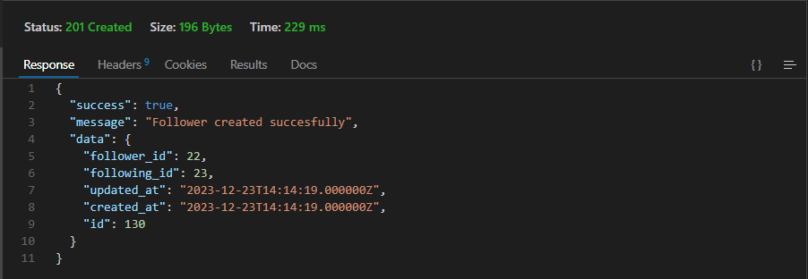

 ###### 

<h1 align="center"> 💥Geek Zone Backend 💥</h1>
 
 

<br>
<p align="center"><a href="https://views.d6m2hk6zqt0er.amplifyapp.com/">https://views.d6m2hk6zqt0er.amplifyapp.com/</a></p> 

# Welcome to Geek Zone backend 
Developed as part of the final project in the Full Stack Developer Bootcamp at Geekshubs Academy.

<div style="text-align: center;">
    
</div>
 
<br>

## Project content 

<details>
  <summary>Contents 📝</summary>
<ol>
  <a href="#"></a></li>
  <li><a href="#objetive">Objective</a></li>
  <li><a href="#about-the-project">About the Project</a></li> 
  <li><a href="#stack">Stack</a></li>
  <li><a href="#diagrama-db">Diagram Database</a></li>
  <li><a href="#local-installation">Local Installation</a></li>
  <li><a href="#endpoints">Endpoints</a></li>
  <li><a href="#validations">Validations</a></li>
  <li><a href="#future-functionalities">Future Functionalities</a></li>
  <li><a href="#contributions">Contributions</a></li>
  <li><a href="#repository-branches">Repository Branches</a></li>
  <li><a href="#issues-and-solutions">Issues and Solutions</a></li>
  <li><a href="#license">License</a></li>  
  <li><a href="#acknowledgments">Acknowledgments</a></li>
  <li><a href="#contact">Contact</a></li>
  <li><a href="#images">Imagenes</a></li>
  Repository Branches
Issues and Solutions

</ol>

</details>

## Objetive
The goal of this project has been to address a need that arises in most online teaching modalities. Due to the lack of physical spaces, students often don't have areas to interact with each other. That's why GEEK ZONE was created as a virtual campus tool where students and teachers can connect and share code.
  
## About the project
I have decided to develop a backend system to support the Geek Zone app. This system will allow both students and teachers to register and start sharing content among themselves.

Additionally, the system will facilitate communication by enabling user tracking, fostering richer connections among users.

The system will also incorporate the creation of events by instructors, where students can confirm their attendance. 

## Stack
<div align="center"> 
 


 
 


 
  
 </div>

## Diagrama DB 

In the diagram, we can observe that each user can have only one role, including 'user' for students, 'admin' for teachers, and 'superadmin' for those who acquire the role of managing the application, possibly the academy manager.

On the other hand, each user will be able to create posts, like and comment on posts, follow classmates and teachers, view events, and communicate participation in said event. The application also features a chat in the development phase.

<div style="text-align: center;">
 
</div>

## Local Installation

<details>
<summary>Installation</summary>

1. Clone the repository.

2. Install the dependencies required for the project. 

    - ` $ composer install`
    - `$ npm install` 
     
3. Connect your repository to the database by creating the .env file and adding the appropriate database credentials:

``` js
        // DB Credentials
        PORT =   
        DB_HOST= 
        DB_USERNAME= ""
        DB_PASSWORD= ""
        DB_NAME=""
        DB_PORT=   
        //  JWT Secret  
        JWT_SECRET= ""

```  
4.  Run the migrations:
    - `$ php artisan migrate `
5. $ Run the seeders 
    - `$ php artisan db:seed`
6. Execute the application with the following command: 
    - ` $ php artisan serve ` 
</details>

## Endpoints 
<details>
<summary>USERS ENDPOINTS</summary>

- USERS
    - REGISTER

            POST http://localhost:8000/api/register

        body:
        ``` js
           {
                "name": "NewUser",
                "last_name": "NewUser",
                "email": "NewUser@gmail.com",
                "password": "Aa1234",
                "city": "NewUser",
                "phone_number": "666666666",
                "photo":"NewUser"
            }
        ```

    - LOGIN

            POST http://localhost:8000/api/login

        body:
        ``` js
            {
                "email": "NewUser@NewUser.com",
                "password": "princes1234" 
            }
        ```
    - PROFILE

            GET http://localhost:8000/api/profile

        - Auth: ` Enter the token to access the profile.`

    - UPDATE

            PUT http://localhost:8000/api/profile

        body:
        ``` js
            {
                 "name": "newname",
                 "last_name": "newlastname",
                 "password":"newpassword",
                 "city":"newcity",
                 "phone_number": "666666666",
                 "photo":"newphoto" 
            }
        ```
        - Auth: `Enter the token to update.`

    - LOGOUT

            POST `http://localhost:8000/api/logout`
        
         - Auth: ` Enter the token to access the profile.`
    
    - DELETE USER

            DELETE `http://localhost:8000/api/user`
        
         - Auth: ` Enter the token to access the profile.`

    - GET ALL USERS

            GET `http://localhost:8000/api/allUsers`
        
        - Auth: ` Enter the token to get the list of workers.`
    
    - GET ALL TEACHERS 

            GET `http://localhost:8000/api/teachers`
        
        - Auth: ` Enter the token to get the list of workers.`

    - GET USER BY ID 

            GET `http://localhost:8000/api/user/22`
        
        - Auth: ` Enter the token to get the list of workers.` 
 
</details>
<details>
<summary>FEED ENDPOINTS</summary>

- APPOINTMENTS

    - GET ALL FEEDS  

             GET `http://localhost:8000/api/feeds`
        
        - Auth: ` Enter the token to get the list of workers.` 

    - GET FEED BY USER ID

            GET `http://localhost:8000/api/feeds/23`
        
        - Auth: ` Enter the token to get the list of workers.` 

    - CREATE FEED

             POST `http://localhost:4000/appointment/createAppointment`

        body:
        ``` js
           {
              "title":"This is the title",
              "content": "Introduce here you post",
              "photo":""
            }
        ```
        - Auth: `Enter the token to create the appointment.`

    - UPDATE

            PUT `http://localhost:8000/api/updateFeed`

        body:
        ``` js
           {
              "id":40,
              "title":"This is the title",
              "content": "Introduce here you post",
              "photo":"Image.png"
            }
        ```
         - Auth: `Enter the token to update the appointment.`

    - DELETE

            DELETE `http://localhost:8000/api/deleteFeed/40`

         - Auth: `Enter the token to delete the appointment.`

    - GET MY FEEDS 

            GET `http://localhost:8000/api/feeds/profile`
        
        - Auth: `Enter the token to retrieve the appointments.`
 
</details>

<details>
<summary>COMMENTS</summary>

- COMMENTS

    - GET ALL COMMENTS BY FEED ID 

            GET `http://localhost:8000/api/comments/24` 

        - Auth: ` Enter the token to get all the users.`

    - CREATE COMMENT

            POST  `http://localhost:8000/api/comments`

        body:
        ``` js
            {
              "feed_id":39,
              "comment": "Introduce your comment here"
            }
        ```
         - Auth: `Enter the token to create the worker.`

    - DELETE COMMENT

            DELETE `http://localhost:8000/api/comments/38`

        - Auth: `Enter the token to delete any user.` 

</details>

<details>
<summary>LIKES</summary> 

- LIKES
    - GET ALL LIKES BY FEED ID 

            GET `http://localhost:8000/api/likes/3` 

    - Auth: ` Enter the token to get all the users.`

    - CREATE LIKE

            POST  `http://localhost:8000/api/like`

        body:
        ``` js
            {
              "feed_id":39 
            }
        ```
        - Auth: `Enter the token to create the worker.`

    - DELETE LIKE

            DELETE `http://localhost:8000/api/like/1`

        - Auth: `Enter the token to delete any user.` 

</details>
<details>
<summary>CHATS</summary> 

- CHATS
    - GET ALL CHATS MY CHATS 
 
        GET `http://localhost:8000/api/mychats` 

    - Auth: ` Enter the token to get all the users.`

    - GET  CHAT BY ID
    
         GET `http://localhost:8000/api/chats/113` 

    - Auth: ` Enter the token to get all the users.`

    - CREATE CHAT

            POST  `http://localhost:8000/api/newchat`

        body:
        ``` js
          {
             "name":"Chat name",
             "user_id":22
           }
        ```
        - Auth: `Enter the token to create the worker.`

    - DELETE CHAT

            DELETE `http://localhost:8000/api/chats/75`

        - Auth: `Enter the token to delete any user.` 

</details>
<details>
<summary>FOLLOWERS</summary> 

- FOLLOWERS
    - GET ALL MY FOLLOWINGS
    
        GET `http://localhost:8000/api/followings` 

      - Auth: ` Enter the token to get all the users.`

    - GET FOLLOWINGS BY USER ID
    
        GET `http://localhost:8000/api/followings/3` 

      - Auth: ` Enter the token to get all the users.`

    - GET ALL MY FOLLOWERS
    
        GET `http://localhost:8000/api/followers` 

      - Auth: ` Enter the token to get all the users.`

    - GET FOLLOWERS BY USER ID
    
        GET `http://localhost:8000/api/followers/3` 

     - Auth: ` Enter the token to get all the users.`

    - FOLLOW
    
        POST  `http://localhost:8000/api/followers`
        
        body:
        ```js
          {
            "following_id": 26
           }
        ``` 
      - Auth: `Enter the token to create the worker.`

    - UNFOLLOW

            DELETE `http://localhost:8000/api/followers/1`

    - Auth: `Enter the token to delete any user.` 

</details>
<details>
<summary>EVENT</summary> 

- EVENTS
    - GET ALL EVENTS 
    
        GET `http://localhost:8000/api/events` 

    - Auth: ` Enter the token to get all the users.` 

    - CREATE EVENT

            POST  `http://localhost:8000/api/events/create`

        body:
        ``` js
          {
             "title":"Event title",
             "content":"Event content info",
             "event_date": "2023-05-20",
             "event_time":"20:30"
           }
        ```
         - Auth: `Enter the token to create the worker.`

    - DELETE EVENT

            DELETE `http://localhost:8000/api/events/14`


        - Auth: `Enter the token to delete any user.` 

</details>
<details>
<summary>EVENT_USER</summary> 

- EVENTS_USER

    - GET ALL USERS EVENT REGISTERED
    
        GET `http://localhost:8000/api/event_user/15` 

    - Auth: ` Enter the token to get all the users.` 

    - JOIN EVENT

            POST  `http://localhost:8000/api/event_user`

        body:
        ``` js
          {
            "event_id": 2
           }
        ```
         - Auth: `Enter the token to create the worker.`

    - DELETE EVENT_USER

            DELETE `http://localhost:8000/api/event_user/2`

    - Auth: `Enter the token to delete any user.` 

</details>
<details>
<summary>SUPER ADMIN</summary> 

- SUPER ADMIN
    -  DELETE USER BY ID
    
        GET `http://localhost:8000/api/deleteOneBySuper/2` 

    - Auth: ` Enter the token to get all the users.` 

    - CHANGE ROLE

            PUT  `http://localhost:8000/api/changeRole`

        body:
        ``` js
          {
            "id":1,
            "role": "user"
           }
        ```
         - Auth: `Enter the token to create the worker.`
 

</details>
<details>
<summary>MESSAGES</summary> 

- MESSAGES
    - GET ALL MESSAGES BY CHAT ID
    
         GET `http://localhost:8000/api/messages/20` 

    - Auth: ` Enter the token to get all the users.` 

    - CREATE MESSAGE

            POST  `http://localhost:8000/api/messages`

        body:
        ``` js
          {
            "chat_id":82,
            "message":"soy el mensaje de prueba"
           }
        ```
         - Auth: `Enter the token to create the worker.`

    - DELETE MESSAGE

            DELETE `http://localhost:8000/api/messages/50`
            

        - Auth: `Enter the token to delete any user.` 

</details>
  
## Future functionalities

<input type="checkbox"> Live Chat Functionality.
<br>
<input type="checkbox"> Input area where you can write code while maintaining formatting.
<br>
<input type="checkbox"> Customized User Search.
<br>
<input type="checkbox"> Mobile Version.
<br>
  
## Contributions
Suggestions and contributions are always welcome. 

You can do this in two ways:

1. Opening an issue.
2. Fork the repository
    - Create a new branch.  
        ```
        $ git checkout -b feature/username-improvement
        ```
    - Commit your changes.
        ```
        $ git commit -m 'feat: improve X thing'
        ```
    - Push the branch.
        ```
        $ git push origin feature/username-improvement
        ```
    - Open a Pull Request.

## Repository Branches

🍃 This project has been developed in the following branches:

1.- **Master**: Considered as the main branch, where the project has been initiated and finalized for deployment purposes.

2.- **Dev**: This branch serves as the pivot for all features.

3.- **Middleware**:  Creation of necessary middlewares for the application, including IsAdmin, IsSuperAdmin, and Auth:Sanctum.

4.- **Models**: Creation of necessary models for database manipulation.

5.- **Seeders**: Creation of necessary seeders for populating the database if needed.

## License

This project is under the MIT License. Please refer to the LICENSE file for more information.

## Issues and Solutions

### Issue 1: Authentication Configuration

-**Description:** Encountered difficulties during the initial setup of authentication.

-**Solution:** Successfully resolved by reviewing the official documentation and ensuring each step was followed correctly.

### Issue 2: Production Deployment Problems

-**Description:**  Errors were encountered while deploying the application in a production environment, presenting issues with hosting.

-**Solution:**  I have not yet found a solution to this problem.

## Acknowledgments

This project has been made possible thanks to the hard work of my teachers Daniel Tarazona and David Ochando, who not only share their knowledge but also instill enthusiasm in us for what we are developing.

  
<strong>Daniel Tarazona</strong><br>
<a href="https://github.com/datata">

</a>
  
<strong>David Ochando</strong><br>
<a href="https://github.com/Dave86dev">

</a> 

I also want to express my gratitude to my colleagues, especially to Andrés Labat and Bienvenida Ladrón, for the many hours of joint study; And finally, to my wife, for the support she has provided me throughout this training. Without her unwavering assistance, this would not have been possible.
  
## Author

- **Vincenzo Donnarumma Veitia**

## Contact   
<a href = "mailto:vincenzodonnarumma22@gmail.com"  target="_blank">

</a>
<a href="https://github.com/vincenzo2202"  target="_blank">
    
</a>  
<a href="https://www.linkedin.com/in/vincenzo2202/" target="_blank">

</a> 

[](#) 
 

## Images

<br>
<div style="text-align: center;">
    
</div>
<br>
<br>
<div style="text-align: center;">
    
</div>
<br>
<br>
<div style="text-align: center;">
    
</div>
<br>
<br>
<div style="text-align: center;">
    
</div>
<br>
<br>
<div style="text-align: center;">
    
</div>
<br>
<br>
<div style="text-align: center;">
    
</div>
<br>
 

 [](#)